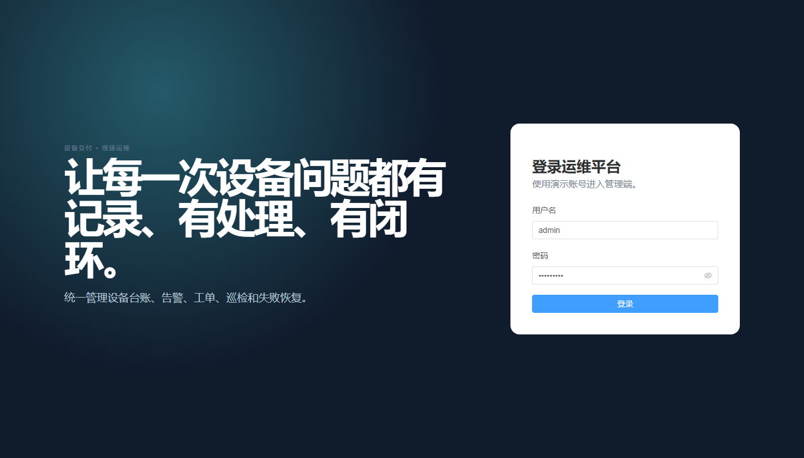
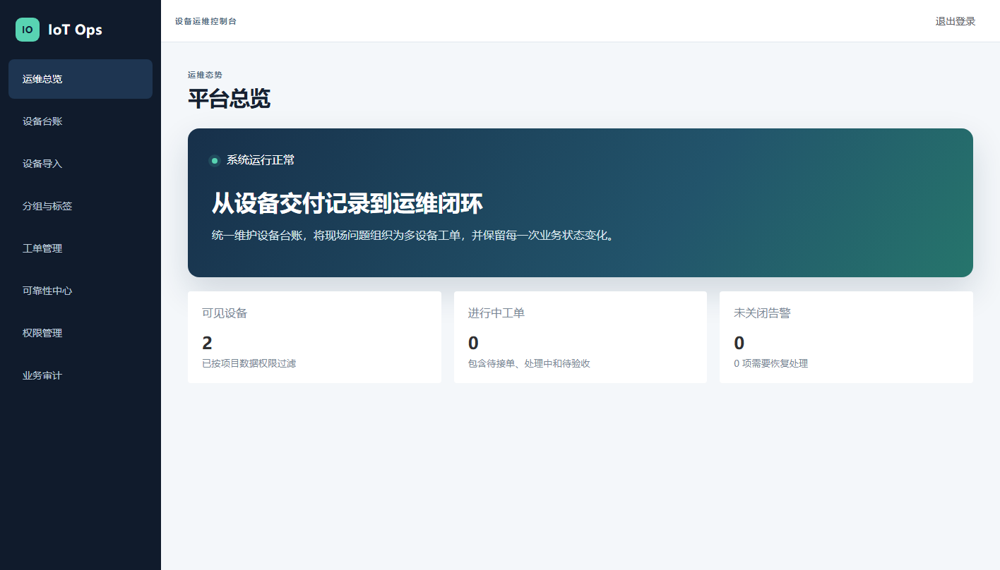
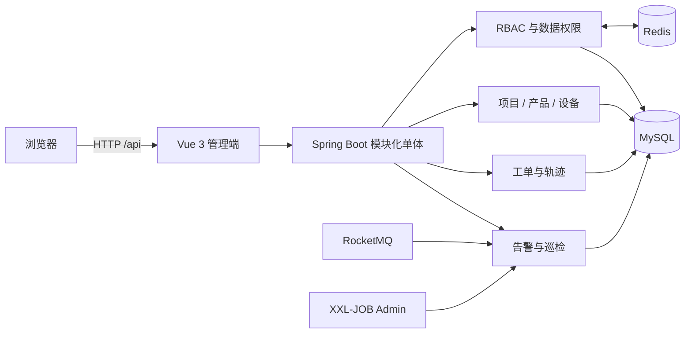

# IoT Ops Platform

IoT Ops Platform 是一套面向设备交付与现场运维的管理平台。它把项目、产品、设备台账、分组标签、批量导入、告警、工单、超时巡检、权限和失败恢复放在同一条可审计业务链路中，让运维人员能够回答：哪台设备出了什么问题、谁在何时处理、失败后如何恢复，以及重复或并发请求最终留下了什么结果。

当前版本：**v1.1.0**





## 核心能力

- 用户、角色、接口权限与项目级数据权限；Redis 权限缓存、变更失效和用户会话注销
- 项目、产品、设备台账、设备分组与标签；设备 SN 应用校验和 MySQL 唯一约束
- Excel 设备导入：原始行号、格式与业务校验、文件内/库内重复、批量查询、`Set`/`Map` 分类、XML 批量写入、错误 CSV 下载
- 一张工单关联多台设备；主表、关系表、轨迹表分离；完整状态机与转派、取消旁路
- `UPDATE ... WHERE status = ?` 加 `affectedRows` 的并发接单与状态迁移
- 父表先分页、关系批量查询，避免一对多 JOIN 直接分页造成父记录重复或缺失
- XXL-JOB 每五分钟触发超时巡检；候选扫描、逐条独立事务、条件更新、`SYSTEM` 轨迹、安全重跑、失败记录与人工补偿
- RocketMQ 告警消费；`eventId` 预查询与数据库唯一约束、告警本地事务、重复消息成功确认、坏消息留档、系统异常重试、修正确认与人工重放
- 请求 ID、结构化业务日志、任务/消费结果、业务审计和 Prometheus 指标
- Vue 3 管理端、OpenAPI、Flyway 初始化、Docker Compose 一键启动和 GitHub Actions

## 架构



后端保持一个部署单元，并按业务能力分包。需要强一致的主记录、关系和轨迹使用 MySQL 本地事务；RocketMQ 与数据库之间不引入分布式事务，而是用至少一次投递、业务幂等和失败恢复闭环保证最终结果。完整模块、ER 图和流程图见 [架构文档](docs/architecture.md)。

## 技术基线

| 区域 | 版本 |
|---|---:|
| Java / Maven Wrapper | 21 / 3.9.9 |
| Spring Boot | 3.5.16 |
| MyBatis-Plus | 3.5.17 |
| Sa-Token | 1.45.0 |
| EasyExcel | 4.0.3 |
| Flyway / SpringDoc | 13.6.0 / 2.9.0 |
| MySQL / Redis | 8.4.11 / 8.2.1 |
| RocketMQ Spring / Broker | 2.3.6 / 5.3.2 |
| XXL-JOB | 3.4.2 |
| Vue / TypeScript / Vite | 3.5.42 / 5.9.3 / 8.3.0 |
| Element Plus / Pinia | 2.14.5 / 4.0.3 |

版本于 2026-09-15 根据官方文档和制品仓库选择，并通过实际编译、测试和 Compose 运行校验。Java 21 是运行基线；本地测试还使用 JDK 25 编译为 Java 21 字节码。选型理由与未采用方案见 [ADR](docs/decisions/001-modular-monolith.md)。

## 一键启动

要求：Docker Desktop 或 Docker Engine（含 Compose）、JDK 21+，并预留约 4 GB 内存。Compose 模式不要求本机安装 Maven、Node、MySQL、Redis、RocketMQ 或 XXL-JOB。

Windows PowerShell：

```powershell
.\scripts\start.ps1
docker compose ps
```

Linux / macOS：

```bash
./scripts/start.sh
docker compose ps
```

启动脚本先用 Maven Wrapper 构建 Java 产物，再构建并启动整套容器。第一次运行需要拉取镜像。MySQL 会创建 `iot_ops` 和 `xxl_job` 数据库，Flyway 自动执行 V1—V5，XXL-JOB 自动注册五分钟巡检任务。

| 入口 | 地址 / 账号 |
|---|---|
| 管理端 | `http://localhost:8080` |
| 平台管理员 | `admin` / `Admin@123` |
| 项目运维员 | `operator` / `Operator@123` |
| OpenAPI UI | `http://localhost:18080/api/swagger-ui/index.html` |
| OpenAPI JSON | `http://localhost:18080/api/v3/api-docs` |
| 健康检查 | `http://localhost:18080/api/actuator/health` |
| XXL-JOB Admin | `http://localhost:8088`，`admin` / `123456` |

`operator` 只有项目 1 的数据范围，也不能进入权限管理和人工恢复页面，适合直接演示接口权限与数据权限的差异。

## 推荐演示流程

管理端是业务操作入口；OpenAPI 展示和调试同一套后端接口；XXL-JOB 是定时任务调度控制端，负责触发后端注册的任务入口。三者最终复用同一个 Spring Boot 业务 Service 并读写同一个 MySQL，不存在三套独立业务逻辑。

1. 用 `admin` 登录，查看总览、项目/产品、设备分组和标签。
2. 在设备页创建台账；尝试重复 SN，观察应用错误和数据库约束的双层保护。
3. 在设备导入页上传 `.xlsx`。表头依次为 `SN`、`Device Name`、`Project Code`、`Product Code`、`IMEI`、`MAC`、`Firmware Version`；查看任务计数并下载错误 CSV。
4. 创建关联多台设备的工单，按 `WAITING -> PROCESSING -> WAIT_VERIFY -> CLOSED` 完成；查看每一步轨迹。
5. 演示三入口串联：在工单页查看一张已经到期但尚未标记超时的工单；进入 XXL-JOB 手动执行 `workOrderTimeoutInspection`；回到可靠性中心查看触发来源、扫描和成功数，再到工单“详情与轨迹”确认超时标记、超时时间与 SYSTEM 轨迹；最后用 OpenAPI 的 `/work-orders/{id}` 和 `/timeout-inspections/executions` 独立核对同一后端结果。快速准备到期工单、故障注入和人工补偿步骤见 [API 与串联演示](docs/api.md)。
6. 发布一个真实 RocketMQ 消息：

   ```powershell
   .\scripts\publish-demo-alarm.ps1
   ```

   或：

   ```bash
   ./scripts/publish-demo-alarm.sh
   ```

   回到可靠性页面查看告警结果。坏消息可以确认修正后重放，且原 `eventId` 不变，防止人工操作生成第二条告警。
7. 进入权限管理，修改运维员角色权限。系统删除 Redis 缓存并注销受影响用户会话，再次登录后生效。

停止容器但保留数据：

```powershell
.\scripts\stop.ps1
```

清空本项目容器与命名数据卷，回到干净演示数据（此命令会删除本项目数据库数据）：

```powershell
.\scripts\clean.ps1
```

Linux / macOS 对应 `./scripts/stop.sh` 与 `./scripts/clean.sh`。

Windows 上可在完成三入口与失败恢复演示数据后运行 `.\scripts\verify-ui-localization.ps1`，用隐藏 Edge 依次加载全部业务页面，并核对中文标题、SYSTEM 超时轨迹及已解决失败记录的中文展示。

## 本地开发

只启动基础依赖，后端和前端在宿主机运行：

```powershell
docker compose -f deploy/compose.infrastructure.yml up -d
.\mvnw.cmd spring-boot:run
```

另开终端：

```powershell
cd frontend
npm ci
npm run dev
```

开发模式管理端为 `http://localhost:5173`。RocketMQ 和 XXL-JOB 适配器默认关闭；需要完整链路时使用根目录 Compose。

## 测试证据

```powershell
.\mvnw.cmd -B verify
cd frontend
npm ci
npm run build
```

最终本地验收包含 9 个单元测试和 16 个常规集成测试，另有 2 个显式开启的独立性能基准；集成测试使用 MySQL 8.4.11 与 Redis 8.2.1 Testcontainers，而不是用内存数据库替代唯一约束、事务和并发行为。覆盖敏感字段序列化、并发接单、轨迹回滚、一对多分页、导入混合错误与中间批次异常、重复巡检、单条回滚与恢复、首次/重复/并发消费、坏消息、系统重试、缓存命中/失效/会话变化和数据范围。

可选基准测试在 1,000 行上比较导入分类阶段的逐行查询候选与批量查询实现：

```powershell
.\mvnw.cmd -B "-Diot.benchmark=true" "-Dit.test=MySqlBusinessFlowIT#benchmarkImportLookupRoundTripsAgainstRowByRowCandidate" verify
```

2026-09-15 的受控本机运行中，逐行候选执行 3,000 次查询用时 1,924 ms，批量实现执行 4 次查询用时 6 ms。该数字只证明同一 Testcontainer、同一进程内的查重/主数据查询阶段，不等同于完整 Excel 导入吞吐。

独立的 500 条真实提交基准执行一次 XML 多值 INSERT：10 轮中应用侧观测的 Mapper 调用耗时中位数为 44.716 ms，包含 commit 的事务总耗时中位数为 54.609 ms；两者均不含解析、查询和业务校验，也不与上面的 6 ms 合并，完整样本与边界见 [测试报告](docs/testing.md)。

## 关键难点与演进

| 问题 | 当前选择 | 代价 / 继续演进条件 |
|---|---|---|
| 批量导入 N 次查询与写入 | 业务键集中收集、`Set`/`Map` 校验、500 条查询批次、200 条 XML INSERT 批次 | 保留行和键会占用堆；文件规模或请求耗时越界后再考虑异步或暂存表 |
| 两人并发接单 | 带旧状态条件的原子 UPDATE，以 affected rows 决定胜者 | 每个迁移有显式 SQL；比进程锁更清楚且可跨实例 |
| 一对多列表分页 | 主表分页后批量加载关系 | 每页两次查询；只有实测延迟需要时才考虑聚合 SQL |
| 重复告警 | eventId 预查询 + 两个唯一约束 + 本地事务 | 多一张结果表与索引；实际数据量触发后才做分区/归档 |
| 超时任务局部失败 | 候选列表 + `REQUIRES_NEW` 单条事务 + failure 表 | 多次提交；单批无法在周期内完成时再评估游标/分片 |
| 权限读取频繁 | Redis cache-aside，写前与提交后失效，角色变更注销会话 | 权限变更要求二次查询；多节点失效延迟出现后再引入事件通知 |

七个完整案例按“业务问题 → 第一版 → 暴露问题 → 候选比较 → 最终选择 → 异常处理 → 测试证据 → 代价 → 后续条件”记录在 [演进文档](docs/evolution.md)。

## 版本记录

- [v0.1.0](docs/releases/v0.1.0.md)：可运行的项目、产品、设备和工单基础版
- [v0.2.0](docs/releases/v0.2.0.md)：完整状态机、批量导入、原子更新和 MySQL 行为测试
- [v0.3.0](docs/releases/v0.3.0.md)：XXL-JOB 巡检、RocketMQ 告警、失败记录和人工恢复
- [v1.0.0](docs/releases/v1.0.0.md)：完整 RBAC、Redis 缓存、管理端、观测、Compose、CI 和公开文档
- [v1.1.0](docs/releases/v1.1.0.md)：中文管理端、工单超时轨迹展示、三入口演示和 500 条 XML INSERT 专项基准

每一版都在对应代码和测试通过后形成独立 Git 提交并打 Tag。详细提交证据可直接查看仓库历史。

## 配置与安全

Compose 中的账号和口令只用于本机演示网络。对外部署前必须通过环境变量替换数据库、XXL-JOB 与平台账号，并限制 MySQL、Redis、RocketMQ、XXL-JOB 和 Actuator 端口的外部访问。仓库忽略 `.env`、构建产物、日志和本地数据；最终发布前会执行密钥与绝对路径扫描。

## 更多文档

- [系统架构、ER 图与核心流程](docs/architecture.md)
- [版本演进与方案比较](docs/evolution.md)
- [测试方法、结果与性能边界](docs/testing.md)
- [技术决策记录](docs/decisions/001-modular-monolith.md)
- [API 入口与调用约定](docs/api.md)

## License

[GNU General Public License v3.0](LICENSE)。项目直接集成 GPL-3.0 的 XXL-JOB Core，因此公开发布采用同一许可证边界。
