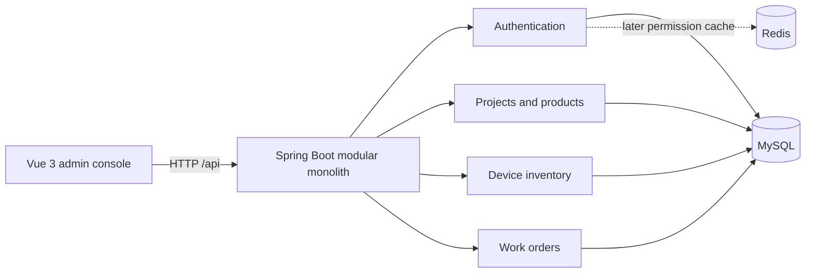

# IoT Ops Platform

IoT Ops Platform is an operations console for teams that deliver and maintain connected devices. It keeps projects, products, device inventory and work orders in one auditable workflow, so an incident can be traced from the affected device to the responsible operator and every state change.

> Current source version: **v0.2.0** — correctness and bulk-processing release. Later tagged versions add automation and production-facing operability; see [Evolution](docs/evolution.md).

## Current capabilities

- Project and product master data
- Device inventory with globally unique serial numbers
- Work orders linked to one or more devices
- Full `WAITING -> PROCESSING -> WAIT_VERIFY -> CLOSED` work-order state machine, with `CANCELED` as a side terminal state
- Conditional updates and `affectedRows` checks for acceptance, submit, verify, cancel and transfer conflicts
- Separate work-order, device-relation and immutable track tables
- Stable one-to-many paging: page the work-order table first, then batch-load device relations
- Excel device import with original row numbers, format/business validation, file/database duplicates, task status and CSV error output
- Bounded key collection, batched database lookup, `Set`/`Map` classification and MyBatis XML batch insert
- Sa-Token sign-in and protected API routes
- Flyway-managed MySQL schema and generic demonstration data
- Vue 3 administration console for sign-in, dashboard, devices and work orders
- Request ID propagation and Spring Boot health/metrics endpoints

## Architecture



The backend is one deployable application split by business capability. This keeps local transactions and debugging straightforward while retaining module boundaries that can be extracted only if measured load or team ownership later justifies it.

## Technology baseline

| Area | Version | Reason |
|---|---:|---|
| Java | 21 | Current LTS language target; the build was also exercised with JDK 25 |
| Spring Boot | 3.5.16 | Stable Boot 3 line with a mature integration ecosystem |
| MyBatis-Plus | 3.5.17 | Boot 3 starter plus explicit pagination parser module |
| Sa-Token | 1.45.0 | Session/token authentication with a Boot 3 starter |
| SpringDoc | 2.9.0 | OpenAPI UI line compatible with Spring Boot 3 |
| Flyway | 13.6.0 | Current Java 21-capable engine; MySQL support is included explicitly |
| MySQL | 8.4 | LTS database line used by local infrastructure |
| EasyExcel | 4.0.3 | Streaming workbook decoding and typed import rows |
| Vue / Vite | 3.5.42 / 8.3.0 | Current frontend baseline; Vite 8 requires Node 20.19+ |

Dependency versions were selected from official project documentation and registries on 2026-09-15, then checked by compiling the actual project. Maven Wrapper 3.9.9 is committed, so a global Maven installation is not required.

## Run locally

Requirements: JDK 21+, Docker with Compose, and Node.js 24 LTS (or another Vite 8-compatible Node release).

```powershell
docker compose -f deploy/compose.infrastructure.yml up -d
.\mvnw.cmd spring-boot:run
```

In another terminal:

```powershell
cd frontend
npm ci
npm run dev
```

Open `http://localhost:5173` and sign in with `admin` / `Admin@123`. OpenAPI is at `http://localhost:8080/api/swagger-ui.html`; health is at `http://localhost:8080/api/actuator/health`.

Stop the baseline dependencies without removing their data:

```powershell
docker compose -f deploy/compose.infrastructure.yml down
```

## Demonstration path

1. Sign in and review the dashboard counts.
2. Open Devices and filter the generic sample inventory.
3. Create a work order for one or more devices.
4. Accept, submit and verify a work order; conditional updates reject stale or concurrent actions.
5. Upload a workbook in Device imports, then inspect or download rejected-row reasons.

## Verification

```powershell
.\mvnw.cmd test
cd frontend
npm ci
npm run build
```

At v0.2.0, `mvnw.cmd verify` runs 6 unit tests and 7 integration tests against an actual MySQL 8.4.11 Testcontainer. The suite covers concurrent acceptance, state transitions, transaction rollback, one-to-many paging and import success/error/rollback behavior. Scheduler and message-consumption evidence is added in v0.3.0. No performance claim is made until a reproducible measurement has been recorded.

## Roadmap recorded as real releases

- **v0.1.0**: runnable master-data, device and work-order baseline
- **v0.2.0**: state-machine correctness, bulk import, one-to-many paging and MySQL integration tests
- **v0.3.0**: timeout inspection, RocketMQ alarm processing, failure recovery and compensation
- **v1.0.0**: RBAC/cache, completed console, observability, one-command Compose and CI

See [docs/evolution.md](docs/evolution.md) for the problem-to-evidence narrative behind each change.

## License

[Apache License 2.0](LICENSE)
