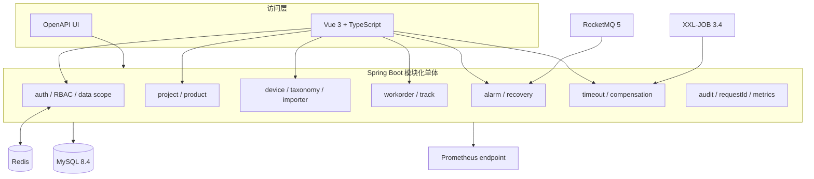
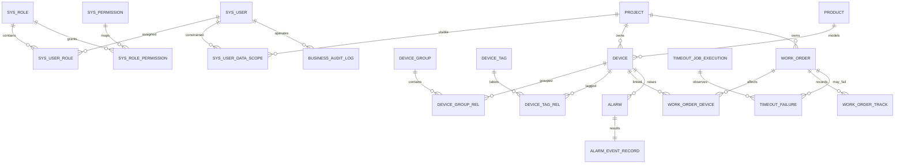
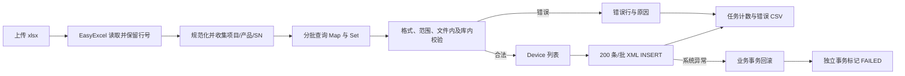
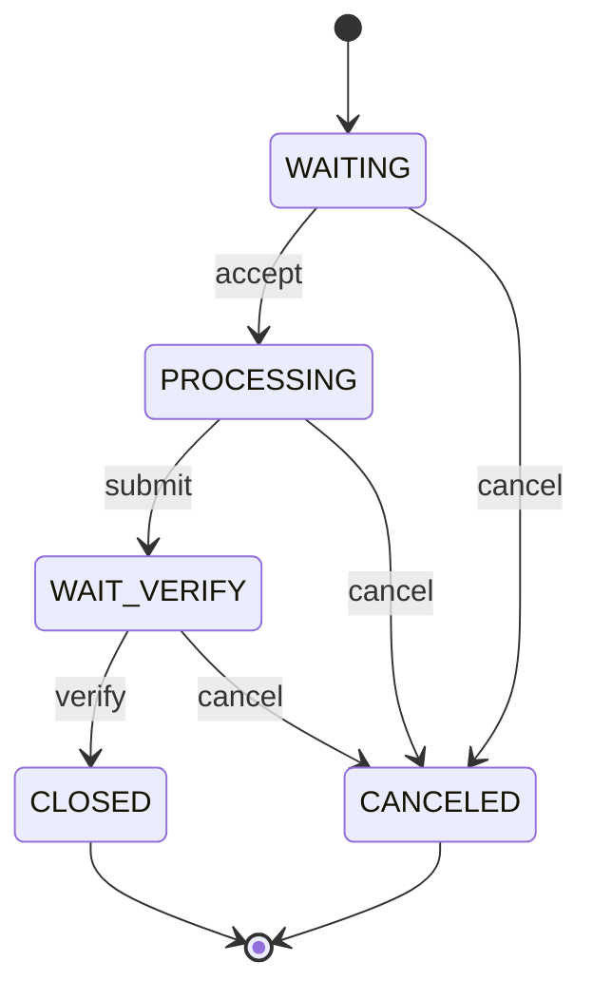
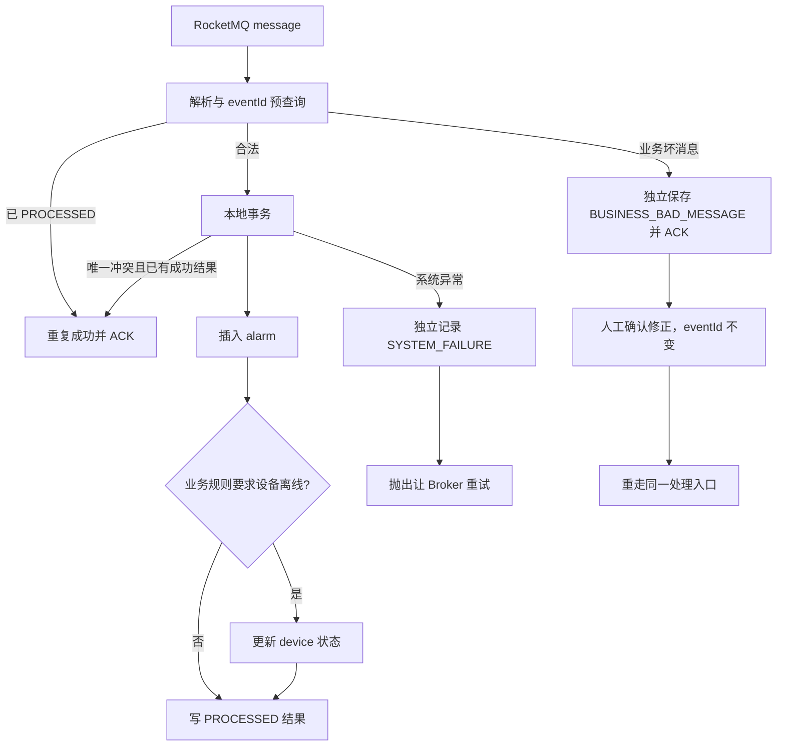
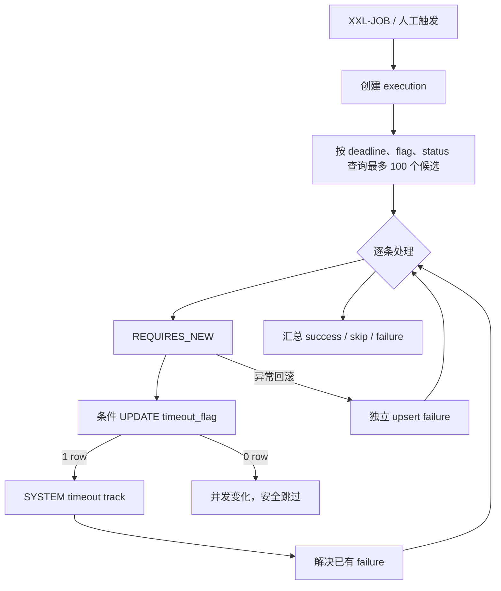
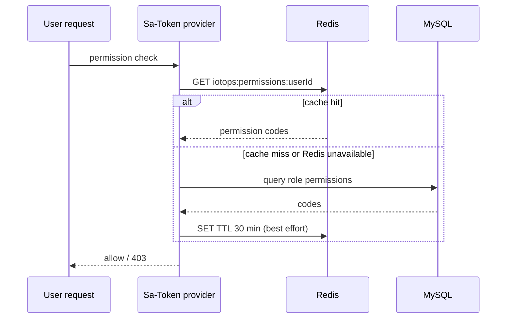

# 系统架构

## 设计目标与边界

IoT Ops Platform 服务设备交付和运维闭环：基础资料建立设备语境，告警触发问题发现，工单承载人工处理，巡检补充自动发现，权限与审计约束谁能看到和改变哪些数据。当前业务量和团队边界没有证明拆分微服务的收益，因此选择按能力分包、单应用部署的模块化单体。

包依赖遵循“适配器调用业务服务，业务服务管理事务，Mapper 只访问本模块表”的方向。外部组件可关闭：本地基础开发不启动 RocketMQ/XXL-JOB 时，核心 HTTP 业务仍可运行；完整 Compose 则打开消费者和执行器。

## 数据模型

关键约束：

- `device.sn` 全局唯一；应用先校验，数据库处理并发竞争。
- `work_order`、`work_order_device`、`work_order_track` 分开，分别表达主流程、多设备关系和不可变轨迹。
- `alarm.event_id` 与 `alarm_event_record.event_id` 都唯一；结果记录承担重复判断和恢复状态。
- `timeout_flag` 与 `(deadline_time, timeout_flag, status)` 索引支持候选查询，轨迹和失败表保留处理证据。
- RBAC 使用用户—角色—权限关系，数据权限单独保存为 `ALL` 或项目集合，避免把接口权限与数据范围混在一个字符串中。

Flyway 迁移按版本保留：V1 基础模型，V2 状态正确性与导入，V3 告警/巡检可靠性，V4 RBAC 与审计。

## 核心业务流程

### 设备导入

解析和分类在写事务之前完成，避免长时间持有数据库事务；合法设备、错误行和成功计数在一个本地事务提交。预查询之后出现并发唯一冲突时，数据库约束使整个写事务回滚，任务再由独立事务标记失败，不会留下半批设备。

### 工单状态机与并发接单

每个迁移使用带当前状态的条件 UPDATE。`affectedRows = 1` 才写操作轨迹；为 0 表示状态已经被其他请求改变。主表更新与轨迹写入共享事务，因此轨迹失败会恢复主表旧状态。转派也使用当前处理人和状态条件，防止覆盖并发变更。

### 告警消费与恢复

Broker 与 MySQL 之间不存在原子提交：数据库提交后 ACK 前崩溃会造成重投。因此最终防线必须是数据库唯一约束，不能只依赖预查询或消息 ID。

### 超时巡检

一次执行不包围整个批次，避免一条坏数据拖回滚其他工单。人工补偿复用同一个单条事务服务；已经完成或进入终态的工单被视为安全解决，仍不满足条件的活跃工单返回明确冲突。

### 权限读取与变更

角色或用户授权变化时，服务在写事务前先失效一次，提交后再失效一次，并注销所有受影响用户会话。写前失效缩短并发窗口，提交后失效消除事务期间重新填充的旧值。Redis 故障时回退数据库，不把缓存可用性升级为认证不可用。

## 事务与失败语义

| 场景 | 事务边界 | 可预期业务错误 | 系统错误 |
|---|---|---|---|
| 创建/迁移工单 | 主表、关系、轨迹同一事务 | 不存在、越权、非法状态、并发冲突 | 全部回滚并返回统一错误 |
| 导入 | 分类无事务；合法写入、错误、计数同一事务 | 错误行保留，合法行可提交 | 所有设备写入回滚，任务独立标记 FAILED |
| 告警 | 单事件本地事务；失败记录独立事务 | 保存坏消息并结束消费 | 保存系统失败后抛出，由 RocketMQ 重试 |
| 巡检 | execution 汇总 + 每工单独立事务 | 条件不满足记 skipped | 单条回滚，失败留档，后续继续 |
| 权限配置 | 关系重建和审计同一事务 | 用户/角色不存在 | 回滚关系；缓存提交后再次清理 |

## 观测与运维

- HTTP 请求接受或生成 `X-Request-Id`，放入 MDC 并在响应中回传。
- 工单轨迹、导入任务、告警事件结果、巡检执行/失败、RBAC 审计分别使用结构化业务表，不依赖应用日志作为唯一证据。
- 关键日志包含 `eventId`、`executionKey`、`workOrderId` 等业务键。
- `/api/actuator/prometheus` 暴露权限缓存 hit/miss/invalidation、告警处理结果和巡检计数；该入口要求登录。
- Compose 为 MySQL、Redis、Broker、后端和前端设置启动依赖或健康检查；RocketMQ 数据卷先由一次性容器修正为 Broker 用户所有。

## 当前不实施的方案

- **微服务与分布式事务**：没有独立扩缩容、故障域或团队所有权证据，现阶段只会增加网络和一致性问题。
- **异步导入与暂存表**：同步上限为 10,000 行，分类阶段实测可通过批量查询显著减少往返；只有超时或堆占用越界才引入。
- **游标扫描与 XXL-JOB 分片**：每次最多 100 个候选且当前无周期超时证据；当单批无法在五分钟窗口内完成时再演进。
- **告警表分区/归档**：先保留完整结果便于审计；数据量、查询计划和保留策略形成后再做。
- **权限变更事件总线**：当前同一应用实例在提交后即可清理缓存；多实例出现可测的失效延迟后再增加 Pub/Sub。
